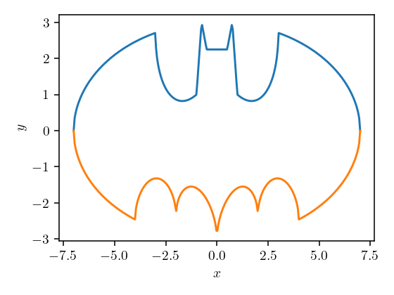

# Batman Curve
[](https://www.python.org/downloads/release/python-3100/)
[](https://pypi.org/project/batman-curve/)
[](https://codecov.io/gh/avitase/batman-curve)
[](https://codecov.io/gh/avitase/batman-curve)
[](https://github.com/psf/black)

A Python library for generating the iconic Batman curve - a mathematical function that creates a plot resembling the legendary Batman symbol.

# Learn More
Explore the mathematical details of the Batman curve on [Wolfram MathWorld](https://mathworld.wolfram.com/BatmanCurve.html):

```
Weisstein, Eric W. "Batman Curve." From MathWorld - A Wolfram Web Resource.
https://mathworld.wolfram.com/BatmanCurve.html
```

## Installation

```bash
# production installation
$ pip install -r requirements.txt
$ pip install batman-curve

# development installation
$ pip install -e .[dev]
$ pre-commit install
```

## Usage

```python
import matplotlib.pyplot as plt
import numpy as np

from batman_curve import batman

x = np.linspace(-7, 7, 300)
upper, lower = batman(x)

fig, ax = plt.subplots()
ax.plot(x, upper)
ax.plot(x, lower)
```


